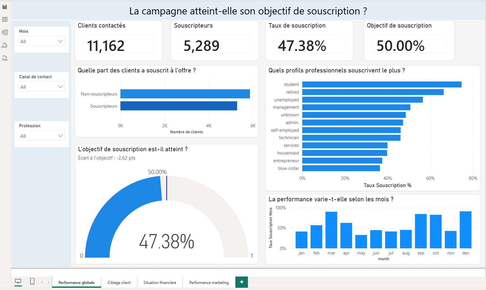
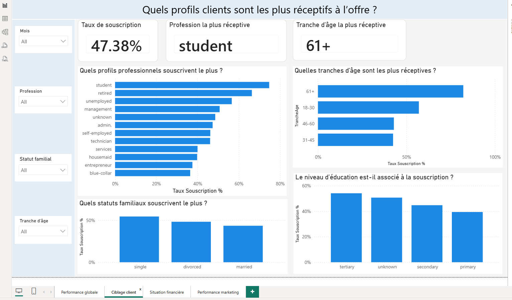
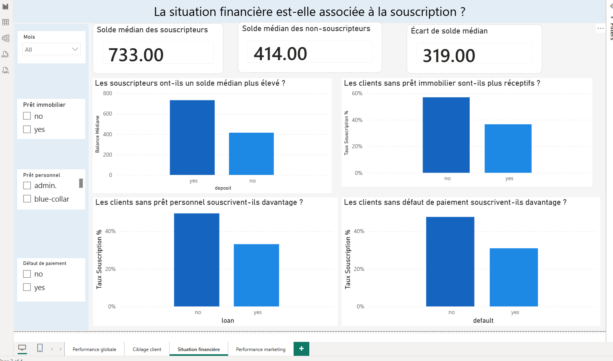
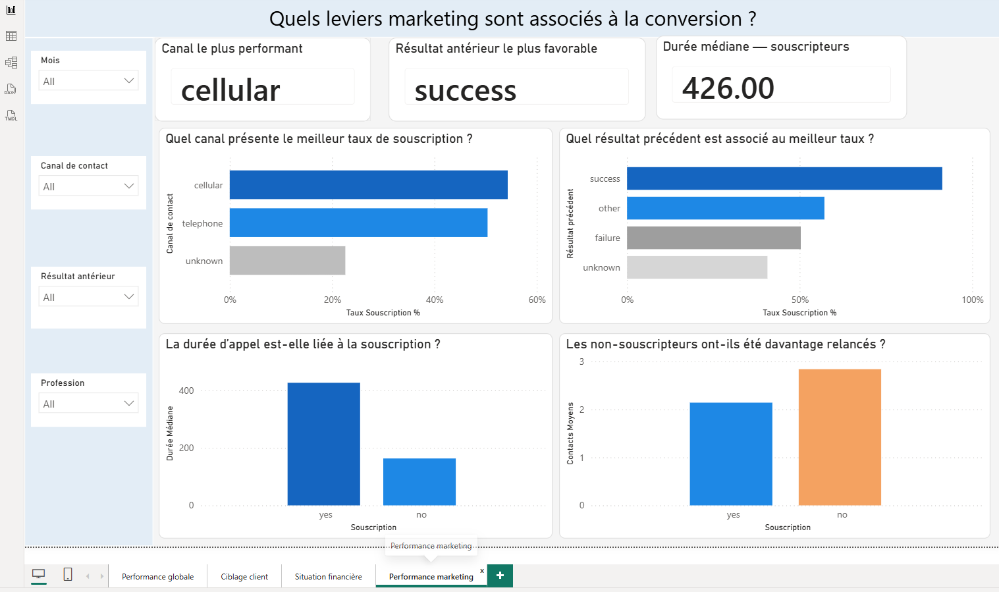

# Bank Marketing Data Analysis

## 📌 Présentation du projet

Ce projet analyse une campagne de télémarketing bancaire visant à promouvoir la souscription à un **dépôt à terme**.

L'objectif est d'identifier les caractéristiques des clients associées à la souscription, d'analyser les principaux leviers de performance de la campagne et de restituer les résultats à travers un **tableau de bord Power BI** afin de faciliter la prise de décision marketing.

Le jeu de données contient **11 162 clients et 17 variables** décrivant notamment le profil sociodémographique des clients, leur situation financière et les caractéristiques des contacts marketing.

---

## 🎯 Objectifs

- Mesurer la performance globale de la campagne par rapport à l'objectif fixé.
- Identifier les profils clients les plus réceptifs à l'offre.
- Étudier les facteurs associés à la souscription.
- Analyser l'influence de la situation financière et des caractéristiques des campagnes marketing.
- Valider certaines associations à l'aide de tests statistiques.
- Construire un tableau de bord Power BI permettant de suivre les principaux KPI.
- Formuler des recommandations métier pour améliorer le ciblage des futures campagnes.

---

## 🔎 Méthodologie

Le projet a été réalisé en plusieurs étapes :

1. Compréhension, contrôle de la qualité et préparation des données.
2. Analyse exploratoire des variables clients, financières et marketing.
3. Comparaison des souscripteurs et des non-souscripteurs.
4. Visualisation des principales tendances sous Python.
5. Tests statistiques :
   - **Chi²** pour étudier l'association entre variables qualitatives et souscription.
   - **Mann-Whitney** pour comparer les distributions de variables quantitatives.
6. Identification et interprétation des principaux enseignements métier.
7. Conception d'un tableau de bord interactif sous **Power BI**.
8. Formulation de recommandations à partir des résultats observés.

---

## 📊 Principaux résultats

### Performance globale

- **11 162 clients** analysés.
- **5 289 souscripteurs** au dépôt à terme.
- Taux de souscription de **47,38 %**, contre un objectif de **50 %**, soit un écart de **-2,62 points**.

### Profils clients

- Les profils **Student (74,72 %)** et **Retired (66,32 %)** présentent les taux de souscription les plus élevés.
- Le profil **Management** atteint également un taux de souscription de **50,7 %**.
- L'analyse met également en évidence des différences de souscription selon l'âge, la situation familiale et le niveau d'éducation.

### Situation financière

- Les souscripteurs présentent un **solde bancaire médian de 733**, contre **414** chez les non-souscripteurs, soit un écart de **319**.
- Les données montrent également des différences de souscription selon la présence ou non de prêts et de défauts de paiement.

### Performance marketing

- Le canal **Cellular** présente un taux de souscription de **54,33 %**, le plus élevé parmi les canaux analysés.
- Un résultat **Success** lors d'une campagne précédente est associé au taux de souscription le plus élevé.
- La durée médiane des contacts atteint **426 secondes chez les souscripteurs**, contre **163 secondes chez les non-souscripteurs**.
- Les non-souscripteurs ont en moyenne été davantage relancés, ce qui suggère qu'une multiplication des contacts n'est pas nécessairement associée à une meilleure conversion.

> **Point de vigilance :** la variable `duration` n'est connue qu'après l'appel. Bien qu'elle soit fortement associée à la souscription, elle ne peut donc pas être utilisée comme critère de ciblage avant le contact.

---

## 💡 Recommandations métier

À partir des résultats observés, plusieurs actions peuvent être envisagées :

- **Prioriser les segments les plus réceptifs**, notamment Student et Retired, dans les futures actions de ciblage.
- **Privilégier le canal Cellular**, associé au meilleur taux de souscription parmi les canaux analysés.
- **Exploiter l'historique des campagnes précédentes**, notamment les succès antérieurs, pour affiner la sélection des prospects.
- **Intégrer la situation financière** dans la segmentation des clients, compte tenu des différences observées entre souscripteurs et non-souscripteurs.
- **Limiter les relances peu performantes** et privilégier une stratégie de contact plus ciblée.
- Ne pas utiliser la **durée d'appel comme variable de ciblage en amont**, puisqu'elle n'est disponible qu'après le contact.

---

## 📈 Dashboard Power BI

Le tableau de bord a été structuré en quatre vues permettant d'explorer les différentes dimensions de la campagne.

### 1. Performance globale



**Objectif :** suivre les principaux KPI de la campagne, comparer le taux de souscription à l'objectif et analyser son évolution.

### 2. Ciblage client



**Objectif :** identifier les profils les plus réceptifs selon la profession, l'âge, la situation familiale et le niveau d'éducation.

### 3. Situation financière



**Objectif :** analyser les différences entre souscripteurs et non-souscripteurs selon le solde bancaire, les prêts et les défauts de paiement.

### 4. Performance marketing



**Objectif :** analyser les canaux de contact, l'historique des campagnes, la durée des échanges et les relances afin d'identifier les leviers associés à la conversion.

---

## 🛠️ Technologies utilisées

- **Python**
- **Pandas**
- **NumPy**
- **SciPy**
- **Matplotlib**
- **Seaborn**
- **Jupyter Notebook**
- **Power BI**

---

## 📁 Structure du repository

```text
bank-marketing-data-analysis/
│
├── README.md
├── bank_marketing_analysis.ipynb
├── bank_marketing_dashboard.pbix
│
└── images/
    ├── dashboard_performance_globale.png
    ├── dashboard_ciblage_client.png
    ├── dashboard_situation_financiere.png
    └── dashboard_performance_marketing.png
```

- `bank_marketing_analysis.ipynb` : préparation, exploration, visualisations et analyses statistiques.
- `bank_marketing_dashboard.pbix` : tableau de bord interactif Power BI.
- `images/` : captures des quatre pages du tableau de bord.

---

## ✅ Conclusion

Cette analyse a permis d'identifier les principaux facteurs associés à la souscription, notamment **le profil client, la situation financière, le canal de contact et l'historique des campagnes**, et de mettre en évidence des segments et leviers marketing prioritaires.

Les résultats ont conduit à des recommandations concrètes visant à **mieux cibler les profils à fort potentiel, privilégier les canaux les plus performants et optimiser les relances**.

Le projet illustre une démarche complète de **Data Analysis**, de la préparation des données à l'analyse statistique et à la restitution décisionnelle sous **Power BI**.
